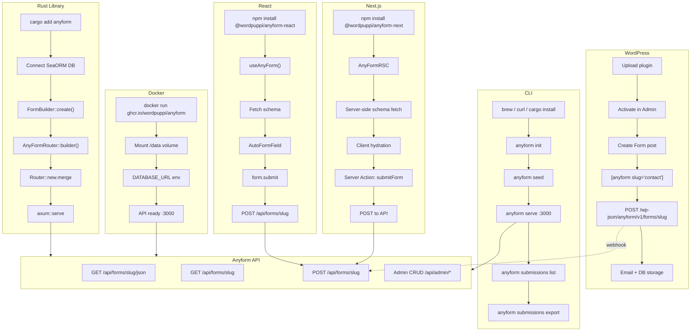

# anyform

[](https://github.com/wordpuppi/anyform/actions/workflows/quick-check.yml)
[](https://crates.io/crates/anyform)
[](https://www.npmjs.com/package/@wordpuppi/anyform-react)
[](LICENSE-MIT)

**Any database. Any form. Zero hassle.**

A standalone form engine that runs anywhere. Install a single binary, connect your database (or use embedded SQLite), and get production-ready forms in seconds.

## Installation

### macOS (Homebrew)

```bash
brew install wordpuppi/tap/anyform
```

### Linux (curl)

```bash
curl -fsSL https://raw.githubusercontent.com/wordpuppi/anyform/main/install.sh | sh
```

### Windows (Scoop)

```powershell
scoop bucket add wordpuppi https://github.com/wordpuppi/scoop-wordpuppi
scoop install anyform
```

### Docker

```bash
docker run -p 3000:3000 ghcr.io/wordpuppi/anyform
```

### Cargo (Rust developers)

```bash
cargo install anyform
```

## Quick Start

```bash
# 1. Initialize (creates ./anyform.db)
anyform init

# 2. Create a form
anyform form create contact --fields "name:text,email:email,message:textarea"

# 3. Start server
anyform serve

# That's it! API at http://localhost:3000
```

## Features

- **Zero-config**: Embedded SQLite, auto-migrations
- **Schema-driven forms**: Define forms in the database, not code
- **Multiple output formats**: JSON API, rendered HTML
- **Multi-step wizards**: Progress tracking with conditional logic
- **Survey & quiz support**: Scoring, results, analytics
- **Multi-database**: SQLite, PostgreSQL, MySQL via SeaORM
- **WASM client**: Browser-side validation and navigation

## Platform Integrations



| Platform | Install | Define Forms | Render | Submit |
|----------|---------|--------------|--------|--------|
| **Rust** | `cargo add anyform` | `FormBuilder::create()` | `AnyFormRouter` | Axum handlers |
| **WordPress** | Plugin upload | Post type editor | `[anyform]` shortcode | WP REST + email |
| **Next.js** | `npm i @wordpuppi/anyform-next` | JSON on server | `<AnyFormRSC>` | Server Actions |
| **React** | `npm i @wordpuppi/anyform-react` | Fetch from API | `useAnyForm` hook | `form.submit()` |
| **CLI** | brew/curl/cargo | `form create --file` | `form render` | `serve` mode |
| **Docker** | `docker run` | API or mount | API endpoints | `POST /api/forms` |

## CLI Commands

```
anyform <COMMAND>

Commands:
  init          Initialize database
  migrate       Run database migrations
  form          Form management
  submissions   Submission management
  seed          Seed example forms
  serve         Start HTTP server

Global Options:
  --database <URL>    Database URL
  -v, --verbose       Verbose output
  -h, --help          Show help
  -V, --version       Show version
```

### Examples

```bash
# Create a form with fields
anyform form create feedback \
  --fields "rating:number,comment:textarea" \
  --required rating

# List all forms
anyform form list

# Export form as JSON
anyform form export contact > contact.json

# Start server with custom options
anyform serve --port 8080 --cors "http://localhost:5173"
```

## API Routes

### Public Routes

| Method | Path | Description |
|--------|------|-------------|
| GET | `/api/forms/{slug}` | Form schema (JSON) |
| GET | `/api/forms/{slug}.html` | Rendered HTML form |
| POST | `/api/forms/{slug}` | Submit form data |
| GET | `/api/forms/{slug}/success` | Success page |

### Admin Routes

| Method | Path | Description |
|--------|------|-------------|
| GET | `/api/admin/forms` | List all forms |
| POST | `/api/admin/forms` | Create form |
| GET | `/api/admin/forms/{id}` | Get form by ID |
| PUT | `/api/admin/forms/{id}` | Update form |
| DELETE | `/api/admin/forms/{id}` | Soft delete form |

## Library Usage (Rust)

Add `anyform` as a dependency in your Axum or Loco app:

```toml
[dependencies]
anyform = "0.4"
```

```rust
use anyform::{AnyFormRouter, FormBuilder, CreateFormInput, ValueType};
use axum::Router;
use sea_orm::DatabaseConnection;

// Add anyform routes to your Axum app
let app = Router::new()
    .merge(AnyFormRouter::new(db.clone()).with_admin().build())
    .with_state(db);

// Programmatic form creation
let form = FormBuilder::create(&db, CreateFormInput::new("contact")
    .with_step("main", |step| step
        .with_field("email", "Email", ValueType::Email)
        .with_field("message", "Message", ValueType::Textarea)
    )
).await?;
```

### Feature Flags

| Feature | Description |
|---------|-------------|
| `default` | `["json", "tera"]` |
| `json` | JSON schema rendering |
| `tera` | Tera template context builder |
| `handlers` | Pre-built Axum handlers |
| `router` | AnyFormRouter builder |
| `admin` | Admin CRUD routes |
| `full` | All features |

## Database Schema

Tables use the `af_` prefix:

| Table | Description |
|-------|-------------|
| `af_forms` | Form definitions |
| `af_steps` | Multi-step form steps |
| `af_fields` | Form fields |
| `af_field_options` | Options for select/radio/checkbox |
| `af_submissions` | Form submissions |
| `af_results` | Quiz result buckets |

## Docker Compose

### With SQLite (default)

```bash
docker compose up
```

### With PostgreSQL

```bash
docker compose -f docker-compose.postgres.yml up
```

## License

MIT OR Apache-2.0
