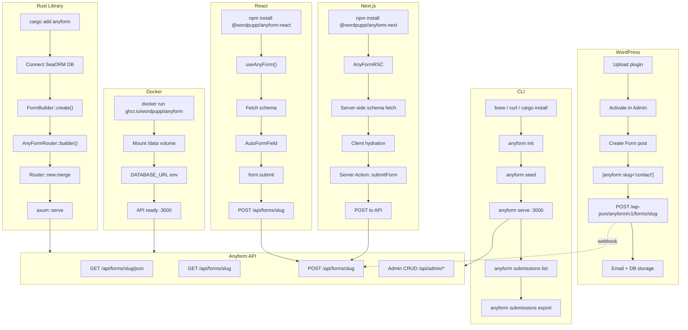

# anyform

[](https://github.com/wordpuppi/anyform/actions/workflows/quick-check.yml)
[](https://crates.io/crates/anyform)
[](https://www.npmjs.com/package/@wordpuppi/anyform-react)
[](LICENSE-MIT)

**Any database. Any form. Zero hassle.**

A schema-driven form engine where forms live in your database, not your code. Change fields, add steps, update logic—no deploys required.

## Why Anyform?

**The problem:** Most form solutions hardcode forms in your frontend. Every field change requires a developer, a PR, and a deploy. Enterprise form builders solve this but cost $200+/year.

**Anyform's approach:** Define forms once as JSON/database records. Deploy to any platform—React, Next.js, WordPress, vanilla JS—from one source of truth.

### Use Cases

| If you need... | Anyform gives you... |
|----------------|----------------------|
| Forms that non-devs can update | Schema-driven forms stored in DB, no code changes |
| Multi-step wizards with conditional logic | Built-in step management, field/step conditions |
| Surveys, quizzes, NPS scoring | Rating fields, scoring, result buckets |
| Same form on multiple platforms | One schema → React, Next.js, WordPress, API |
| WPForms Pro features without $199/year | Free WordPress plugin with full feature parity |

### Who It's For

- **App developers** building SaaS with user-configurable forms
- **WordPress users** who need multi-step/conditional forms without paid plugins
- **Teams** where marketing/ops need to iterate on forms without engineering
- **Headless CMS projects** serving forms via API

### Who It's Not For

- Simple static contact forms (use React Hook Form + a webhook)
- Drag-and-drop visual builders (Anyform uses JSON schemas)
- File uploads or payments (not yet supported)

## Installation

### macOS (Homebrew)

```bash
brew install wordpuppi/tap/anyform
```

### Linux (curl)

```bash
curl -fsSL https://raw.githubusercontent.com/wordpuppi/anyform/main/install.sh | sh
```

### Windows (Scoop)

```powershell
scoop bucket add wordpuppi https://github.com/wordpuppi/scoop-wordpuppi
scoop install anyform
```

### Docker

```bash
docker run -p 3000:3000 ghcr.io/wordpuppi/anyform
```

### Cargo (Rust developers)

```bash
cargo install anyform
```

## Quick Start

```bash
# 1. Initialize (creates ./anyform.db)
anyform init

# 2. Create a form
anyform form create contact --fields "name:text,email:email,message:textarea"

# 3. Start server
anyform serve

# That's it! API at http://localhost:3000
```

## Features

- **Zero-config**: Embedded SQLite, auto-migrations
- **Schema-driven forms**: Define forms in the database, not code
- **Multiple output formats**: JSON API, rendered HTML
- **Multi-step wizards**: Progress tracking with conditional logic
- **Survey & quiz support**: Scoring, results, analytics
- **Multi-database**: SQLite, PostgreSQL, MySQL via SeaORM
- **WASM client**: Browser-side validation and navigation

## Platform Integrations


```mermaid
flowchart TB
    subgraph RS["Rust Library"]
        RS1["cargo add anyform"] --> RS2[Connect SeaORM DB]
        RS2 --> RS3["FormBuilder::create()"]
        RS3 --> RS4["AnyFormRouter::builder()"]
        RS4 --> RS5[Router::new.merge]
        RS5 --> RS6[axum::serve]
    end

    subgraph WP["WordPress"]
        WP1[Upload plugin] --> WP2[Activate in Admin]
        WP2 --> WP3[Create Form post]
        WP3 --> WP4["[anyform slug='contact']"]
        WP4 --> WP5[POST /wp-json/anyform/v1/forms/slug]
        WP5 --> WP6[Email + DB storage]
    end

    subgraph NJ["Next.js"]
        NJ1[npm install @wordpuppi/anyform-next] --> NJ2["AnyFormRSC"]
        NJ2 --> NJ3[Server-side schema fetch]
        NJ3 --> NJ4[Client hydration]
        NJ4 --> NJ5[Server Action: submitForm]
        NJ5 --> NJ6[POST to API]
    end

    subgraph RC["React"]
        RC1[npm install @wordpuppi/anyform-react] --> RC2["useAnyForm()"]
        RC2 --> RC3[Fetch schema]
        RC3 --> RC4[AutoFormField]
        RC4 --> RC5[form.submit]
        RC5 --> RC6[POST /api/forms/slug]
    end

    subgraph CLI["CLI"]
        CLI1[brew / curl / cargo install] --> CLI2[anyform init]
        CLI2 --> CLI3[anyform seed]
        CLI3 --> CLI4[anyform serve :3000]
        CLI4 --> CLI5[anyform submissions list]
        CLI5 --> CLI6[anyform submissions export]
    end

    subgraph DK["Docker"]
        DK1[docker run ghcr.io/wordpuppi/anyform] --> DK2[Mount /data volume]
        DK2 --> DK3[DATABASE_URL env]
        DK3 --> DK4[API ready :3000]
    end

    subgraph API["Anyform API"]
        A1[GET /api/forms/slug/json]
        A2[GET /api/forms/slug]
        A3[POST /api/forms/slug]
        A4[Admin CRUD /api/admin/*]
    end

    RS6 --> API
    CLI4 --> API
    DK4 --> API

    RC6 --> A3
    NJ6 --> A3
    WP5 -.->|webhook| A3
```

| Platform | Install | Define Forms | Render | Submit |
|----------|---------|--------------|--------|--------|
| **Rust** | `cargo add anyform` | `FormBuilder::create()` | `AnyFormRouter` | Axum handlers |
| **WordPress** | Plugin upload | Post type editor | `[anyform]` shortcode | WP REST + email |
| **Next.js** | `npm i @wordpuppi/anyform-next` | JSON on server | `<AnyFormRSC>` | Server Actions |
| **React** | `npm i @wordpuppi/anyform-react` | Fetch from API | `useAnyForm` hook | `form.submit()` |
| **CLI** | brew/curl/cargo | `form create --file` | `form render` | `serve` mode |
| **Docker** | `docker run` | API or mount | API endpoints | `POST /api/forms` |

## CLI Commands

```
anyform <COMMAND>

Commands:
  init          Initialize database
  migrate       Run database migrations
  form          Form management
  submissions   Submission management
  seed          Seed example forms
  serve         Start HTTP server

Global Options:
  --database <URL>    Database URL
  -v, --verbose       Verbose output
  -h, --help          Show help
  -V, --version       Show version
```

### Examples

```bash
# Create a form with fields
anyform form create feedback \
  --fields "rating:number,comment:textarea" \
  --required rating

# List all forms
anyform form list

# Export form as JSON
anyform form export contact > contact.json

# Start server with custom options
anyform serve --port 8080 --cors "http://localhost:5173"
```

## API Routes

### Public Routes

| Method | Path | Description |
|--------|------|-------------|
| GET | `/api/forms/{slug}` | Form schema (JSON) |
| GET | `/api/forms/{slug}.html` | Rendered HTML form |
| POST | `/api/forms/{slug}` | Submit form data |
| GET | `/api/forms/{slug}/success` | Success page |

### Admin Routes

| Method | Path | Description |
|--------|------|-------------|
| GET | `/api/admin/forms` | List all forms |
| POST | `/api/admin/forms` | Create form |
| GET | `/api/admin/forms/{id}` | Get form by ID |
| PUT | `/api/admin/forms/{id}` | Update form |
| DELETE | `/api/admin/forms/{id}` | Soft delete form |

## Library Usage (Rust)

Add `anyform` as a dependency in your Axum or Loco app:

```toml
[dependencies]
anyform = "0.4"
```

```rust
use anyform::{AnyFormRouter, FormBuilder, CreateFormInput, ValueType, init_schema};
use axum::Router;
use sea_orm::DatabaseConnection;

// Initialize schema (alternative to migrations, safe to call multiple times)
init_schema(&db).await?;

// Add anyform routes to your Axum app
let app = Router::new()
    .merge(AnyFormRouter::new(db.clone()).with_admin().build())
    .with_state(db);

// Programmatic form creation
let form = FormBuilder::create(&db, CreateFormInput::new("contact")
    .with_step("main", |step| step
        .with_field("email", "Email", ValueType::Email)
        .with_field("message", "Message", ValueType::Textarea)
    )
).await?;
```

### Embedded Usage

For embedding anyform into an existing application with its own database, use `init_schema` instead of migrations:

```rust
use anyform::{init_schema, FormBuilder, CreateFormInput};
use sea_orm::Database;

// Connect to your existing database
let db = Database::connect("sqlite:my_app.db").await?;

// Initialize anyform tables (idempotent, safe to call on every startup)
init_schema(&db).await?;

// Now use anyform normally
let form = FormBuilder::create(&db, CreateFormInput::new("contact", "contact-form")
    .step(CreateStepInput::new("Main")
        .field(CreateFieldInput::new("email", "Email", "email").required())
    )
).await?;
```

### Feature Flags

| Feature | Description |
|---------|-------------|
| `default` | `["json", "tera"]` |
| `json` | JSON schema rendering |
| `tera` | Tera template context builder |
| `handlers` | Pre-built Axum handlers |
| `router` | AnyFormRouter builder |
| `admin` | Admin CRUD routes |
| `full` | All features |

## Database Schema

Tables use the `af_` prefix:

| Table | Description |
|-------|-------------|
| `af_forms` | Form definitions |
| `af_steps` | Multi-step form steps |
| `af_fields` | Form fields |
| `af_field_options` | Options for select/radio/checkbox |
| `af_submissions` | Form submissions |
| `af_results` | Quiz result buckets |

## Docker Compose

### With SQLite (default)

```bash
docker compose up
```

### With PostgreSQL

```bash
docker compose -f docker-compose.postgres.yml up
```

## License

MIT OR Apache-2.0
